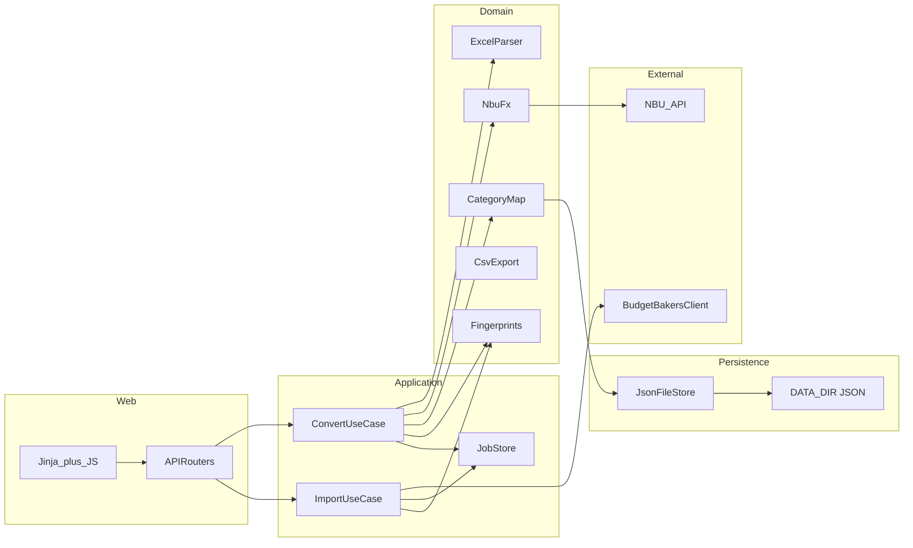
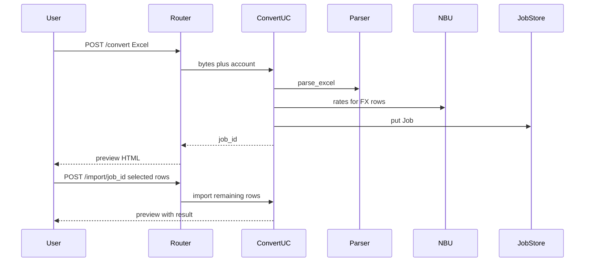

# Architecture

BudgetBakersImport is a **modular monolith**: FastAPI + Jinja templates + JSON files under `DATA_DIR`. It converts a bank Excel statement to BudgetBakers CSV and/or posts records to the Wallet API.

This document describes the **as-built** design. Auth, multi-user tenancy, and extra process types are out of scope.

## Constraints

- Localhost / Docker on a single machine; **no web UI authentication**
- **`WEB_CONCURRENCY=1` is required.** Conversion jobs live in process memory. Extra uvicorn workers fork the job map and can lose preview state or double-import.
- Durable state is JSON under `DATA_DIR` (default `./data`, `/data` in Docker)
- Money is `Decimal` through the domain. Wallet `POST /records` JSON uses a JSON number (`float(str(amount))`) because the API expects a numeric `amount.value`
- Blocking I/O (Excel parse, NBU, Wallet): `POST /convert` reads the upload on the event loop, then runs `convert_upload` via `run_in_threadpool`. Import routes are synchronous (threadpool).

## Layers

| Layer | Package | Owns |
|---|---|---|
| HTTP / UI | `app/routers/`, `app/views.py`, `app/templates/` | Routes, flash messages, Jinja context |
| Application | `app/use_cases/`, `app/jobs.py` | Convert/import orchestration, in-memory jobs |
| Domain | `app/services/` | Parse, FX, mapping, CSV, fingerprints, record payloads |
| Persistence | `app/persistence/` | Atomic JSON files |
| Clients | `app/clients/` | Shared BudgetBakers HTTP adapter |
| Cross-cutting | `app/settings.py`, `app/errors.py`, `app/i18n.py`, `app/locales/` | Config, error codes, translations |

`app/main.py` only builds the FastAPI app: settings, logging, stores, `include_router`.

## Convert and import

1. Upload `.xlsx` / `.xlsm` (size capped by `MAX_UPLOAD_BYTES`).
2. Parser keeps completed rows; FX converts USD/EUR to UAH (NBU, disk+memory cache, lookback).
3. Category mapping store maps bank names; unmapped names are kept.
4. Hybrid dedup: local fingerprints + optional Wallet `GET /records`.
5. A typed `Job` is stored in memory (last 20). CSV is built at download time, not cached on the job.
6. Import posts batches of 20 to `POST /records`. Succeeded **row indices** are recorded on the job so remaining rows can be retried. Fingerprints and import history are written for successes only.

## Jobs

`app/jobs.py`:

- `Job` — `job_id`, timestamps, account, `ConversionResult`, `imported_indices`
- `JobStore` — in-memory `dict`, evict oldest beyond 20
- Jobs are **not** persisted. Restart clears preview. Do not raise `WEB_CONCURRENCY` above 1.

A job is fully imported only when every non-zero row index is in `imported_indices`. Partial success leaves the rest selectable.

## Persistence

All durable files go through `JsonFileStore`: thread lock + write to a temp file in the same directory + `os.replace`.

| File | Store | Purpose |
|---|---|---|
| `accounts.json` | `AccountsStore` | Account directory |
| `category_mappings.json` | `CategoryMappingStore` | Bank → Wallet category names |
| `discovered_bank_categories.json` | `CategoryMappingStore` | Categories seen in uploads |
| `bb_categories_cache.json` | `CategoryCacheStore` | Cached `GET /categories` |
| `prefs.json` | `PrefsStore` | Last used account |
| `import_fingerprints.json` | `FingerprintStore` | Dedup of successful imports |
| `import_history.json` | `ImportHistoryStore` | Capped API import log |
| `nbu_fx_cache.json` | `NbuFxConverter` | NBU rates by date+currency |

`app/services/*_store.py` re-export persistence classes for older imports.

## HTTP clients

`app/clients/budgetbakers.py` (`BudgetBakersClient`) owns:

- Bearer auth, pagination (`limit` / `offset` / `nextOffset`)
- 401 / 403 / 404 / 429 mapping to `AppError` codes
- Payload item extraction

Facades keep the previous constructors (optional `httpx.Client`) so tests inject a mock transport:

- `BudgetBakersAccountsClient`
- `BudgetBakersCategoriesClient`
- `BudgetBakersRecordsClient` — batching, 207 parsing, payload builders stay in `app/services/records.py`

NBU is `app/services/fx_nbu.py` (separate base URL).

## Errors and i18n

Domain code raises `AppError` with a stable `code` (and `params`). Routers translate with `t(exc.code, **exc.params)`. Parser/FX warnings are `ErrorMessage` values translated at the view.

UI strings live in `app/locales/uk.json` and `en.json`. Default language is Ukrainian (`bbi_lang` cookie).

## Health

`GET /healthz` returns `{ "status": "ok"|"degraded", "data_dir": "ok"|"error" }`. Docker HEALTHCHECK treats non-ok HTTP as failure; the handler still returns 200 when the process is up so liveness is preserved, and `data_dir` reports volume writability.

## Non-goals

- PostgreSQL, Redis, Celery, or other extra processes
- A separate SPA frontend
- Multi-user auth, CSRF for public internet exposure, per-card account mapping

If jobs must survive restart or more than one worker, persist `JobStore` first — do not add a database until that requirement exists.
